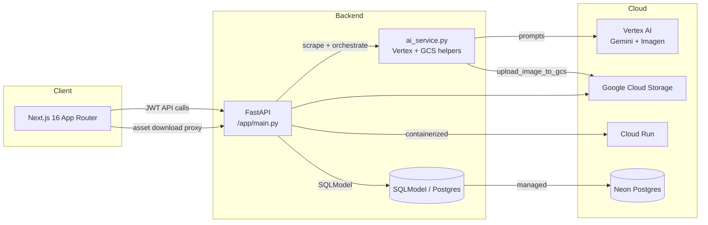

# Campaign Studio · Autonomous AI Marketing Agent


Campaign Studio is an end-to-end **autonomous AI marketing agent** that scrapes product URLs, generates platform-specific ad copy, renders campaign-ready imagery, and synchronizes all assets to the cloud. It ships with a polished dark-mode dashboard, persistent storage on Google Cloud Storage, and production-ready API endpoints.

> **Live Demo:** https://ai-marketing-campaign.vercel.app/


---

## ✨ Features

- **Multi-Agent Workflow** – Gemini + Imagen handle scraping, strategy, analytics, and art generation in coordinated stages.
- **Cloud Persistence (GCS)** – All generated and uploaded media is stored in Google Cloud Storage with secure proxy downloads.
- **Relational Data (Neon / Postgres)** – SQLModel models campaigns, images, texts, and auth, backed by a managed Postgres database.
- **Dark Mode UI** – Production-grade Next.js dashboard with Tailwind, Radix UI, and framer-motion flourishes.

---

## 🧱 Architecture



---

## 🛠️ Tech Stack

- **Frontend:** Next.js 16, React 19, Tailwind CSS v4, Radix UI, framer-motion, next-themes, Sonner
- **Backend:** FastAPI, SQLModel, Vertex AI SDK, httpx, Pillow, Google Cloud Storage SDK
- **Infrastructure:** Docker, Google Cloud Run, Neon Postgres, Vercel, GitHub Actions (extendable)

---

## 🚀 Getting Started

### 1. Clone the repository
```bash
git clone https://github.com/your-org/campaign-studio.git
cd campaign-studio
```

### 2. Backend setup
```bash
cd app
python -m venv .venv
source .venv/bin/activate  # Windows: .venv\\Scripts\\activate
pip install --upgrade pip
pip install -r requirements.txt
```

Create `app/.env` (or export vars) with:
```
DATABASE_URL=postgresql+psycopg2://...
GOOGLE_PROJECT_ID=your-project
GOOGLE_LOCATION=us-central1
SECRET_KEY=change-me
ACCESS_TOKEN_EXPIRE_MINUTES=120
```

Run FastAPI locally:
```bash
uvicorn main:app --reload --port 8000
```

### 3. Frontend setup
```bash
cd ../frontend
npm install    # or pnpm install
echo "NEXT_PUBLIC_API_URL=http://127.0.0.1:8000" > .env.local
npm run dev    # starts Next.js on http://localhost:3000
```

---

## ☁️ Deployment

### Backend → Google Cloud Run
```bash
cd app
gcloud builds submit --tag gcr.io/PROJECT_ID/campaign-studio
gcloud run deploy campaign-studio \
  --image gcr.io/PROJECT_ID/campaign-studio \
  --region us-central1 \
  --set-env-vars DATABASE_URL=... ,GOOGLE_PROJECT_ID=...,GOOGLE_LOCATION=...
```

### Frontend → Vercel
```bash
cd frontend
vercel login
vercel --prod
```
Configure `NEXT_PUBLIC_API_URL` in Vercel to point at your Cloud Run hostname.

---

## 📦 Project Structure
```
app/
  ├── main.py              # FastAPI entrypoint + endpoints
  ├── ai_service.py        # Vertex AI orchestration + GCS helpers
  ├── models.py            # SQLModel schemas
  ├── database.py          # Engine + session factory
  └── requirements.txt
frontend/
  ├── src/app/page.tsx     # Dashboard & campaign UI
  ├── src/components/ui    # Reusable primitives
  └── package.json

```

---

## 📄 License

Campaign Studio is released under the [MIT License](./LICENSE).
```, 
